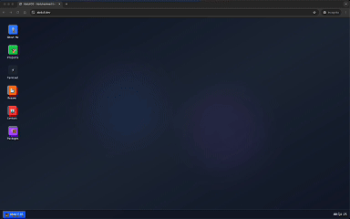

# AbdullOS - Interactive Portfolio

A creative and interactive portfolio website that simulates a desktop operating system interface. Built with Next.js, React, TypeScript, and Tailwind CSS.

*Watch the full AbdullOS experience in action*

<a href="./media/screen.mp4">
  
</a>

## 🚀 Features

### Desktop Environment
- **Boot Screen**: Authentic OS boot sequence with typing animation
- **Desktop Interface**: Windows-like desktop with draggable windows
- **Taskbar**: Bottom taskbar with window management and system tray
- **Window Management**: Minimize, maximize, and close windows

### Applications
- **About Me**: Professional information and skills overview
- **Projects**: Showcase of recent work and achievements
- **Terminal**: Interactive terminal with custom commands
- **Resume**: Professional resume viewer
- **Contact**: Contact information and social links
- **Package Manager**: Interactive package installation simulation

### Interactive Terminal
The terminal includes custom commands:
- `help` - Show available commands
- `ls` - List directory contents
- `cat <file>` - Display file contents
- `whoami` - Display current user
- `uname` - System information
- `ps` - Show running processes
- `open <app>` - Open applications
- `curl <url>` - Open URLs in new tabs
- `ssh <host>` - Connect to remote hosts
- `install <pkg>` - Open package manager

## 📦 Installation

1. **Clone the repository**
   ```bash
   git clone https://github.com/abdoulrasheed/os-theme.git
   cd abdullos
   ```

2. **Install dependencies**
   ```bash
   npm install
   # or
   yarn install
   # or
   pnpm install
   ```

3. **Run the development server**
   ```bash
   npm run dev
   # or
   yarn dev
   # or
   pnpm dev
   ```

4. **Open your browser**
   Navigate to [http://localhost:3000](http://localhost:3000)

## 🚀 Available Scripts

```bash
# Development
npm run dev          # Start development server
npm run build        # Build for production
npm run start        # Start production server
npm run lint         # Run ESLint

# Package Management
npm install          # Install dependencies
npm update           # Update dependencies
```

## 📁 Project Structure

```
abdullos/
├── app/                    # Next.js App Router
│   ├── globals.css        # Global styles
│   ├── layout.tsx         # Root layout
│   └── page.tsx           # Main page component
├── components/            # React components
│   ├── apps/             # Application components
│   │   ├── AboutApp.tsx
│   │   ├── ContactApp.tsx
│   │   ├── PackageManagerApp.tsx
│   │   ├── ProjectsApp.tsx
│   │   ├── ResumeApp.tsx
│   │   └── TerminalApp.tsx
│   ├── ui/               # UI components (shadcn/ui)
│   ├── BootScreen.tsx    # OS boot screen
│   ├── Desktop.tsx       # Main desktop interface
│   ├── Taskbar.tsx       # Bottom taskbar
│   └── Window.tsx        # Window component
├── hooks/                # Custom React hooks
├── lib/                  # Utility functions and context
│   ├── WindowContext.tsx # Window management context
│   └── utils.ts          # Utility functions
├── public/               # Static assets
└── styles/               # Additional styles
```

## 🎨 Customization

### Adding New Applications
1. Create a new component in `components/apps/`
2. Add the app to the `desktopApps` array in `components/Desktop.tsx`
3. Add window management logic in `lib/WindowContext.tsx`

### Styling
- Global styles: `app/globals.css`
- Component styles: Tailwind CSS classes
- Theme customization: `components/theme-provider.tsx`

### Terminal Commands
Add new commands in `components/apps/TerminalApp.tsx`:
```typescript
const commands: Record<string, () => string[]> = {
  // Add your custom command here
  mycommand: () => ["Your command output"]
}
```

## 🤝 Contributing

1. Fork the repository
2. Create a feature branch
3. Make your changes
4. Test thoroughly
5. Submit a pull request

## 📄 License

This project is open source and available under the [MIT License](LICENSE).

## 👨‍💻 Author

**Abdulrasheed Ibrahim**
- Email: hello@abdull.dev
- LinkedIn: [linkedin.com/in/abdoulrasheed](https://linkedin.com/in/abdoulrasheed)
- GitHub: [github.com/abdull](https://github.com/abdull)
- Portfolio: [abdull.dev](https://www.abdull.dev)

---

**AbdullOS v2.0 - Professional Developer Edition** 🖥️ 
